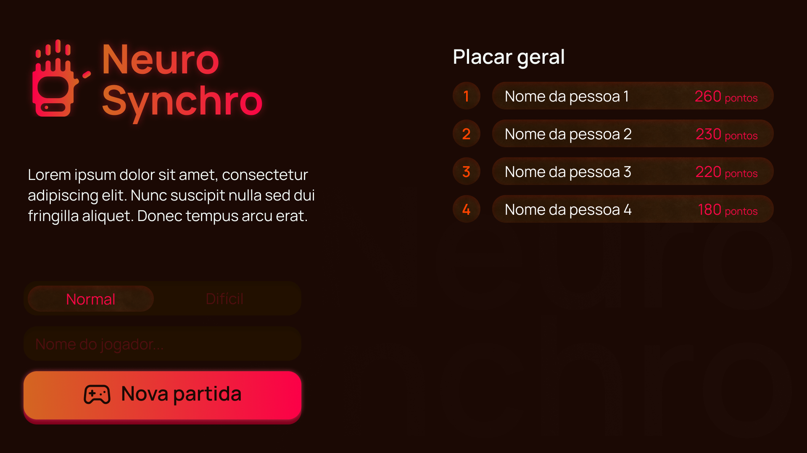

# 🦾 Projeto: Braço Robótico Controlado por Visão Computacional e Arduino

Este projeto é um sistema de controle de um braço robótico impresso em 3D, utilizando gestos manuais reconhecidos por visão computacional e comunicação com Arduino. Foi desenvolvido para uma competição acadêmica e integra técnicas avançadas de visão computacional, aprendizado de máquina e controle de hardware.

---

## 📋 Funcionalidades Principais

- **Reconhecimento de Gestos para Controle do Braço Robótico**: Utiliza o MediaPipe para identificar gestos e controlar a abertura e o fechamento dos dedos do braço robótico.
- **Controle em Tempo Real**: Comunicação em tempo real com Arduino para movimentação precisa dos servos.
- **Registro de Partidas e Pontuações**: Permite o gerenciamento das sessões de jogo e a persistência dos dados no banco de dados SQLite.

---

## 📂 Estrutura do Projeto

### Diretórios e Arquivos

```plaintext
├── arduino/
│   └── servoController.ino           # Código Arduino para controle dos servos
├── init/
│   └── schema.sql                    # Esquema de inicialização do banco de dados SQLite
├── src/
│   ├── main/
│   │   ├── controllers/              # Controladores principais do jogo
│   │   │   ├── __init__.py           # Inicialização do módulo de controladores
│   │   │   ├── game_handler.py        # Lógica de manipulação do jogo
│   │   │   ├── game_handler_test.py   # Testes para a lógica de manipulação do jogo
│   │   │   └── game_manager.py        # Gerenciamento do jogo e sessões
│   │   ├── queues/                   # Fila de tarefas e comunicação do jogo
│   │   │   ├── __init__.py           # Inicialização do módulo de filas
│   │   │   ├── desafios_queues.py     # Fila de desafios
│   │   │   └── message_queue.py       # Fila para mensagens do jogo
│   │   ├── readers/                  # Leitura de gestos para controle
│   │   │   └── handReader.py         # Módulo de leitura e interpretação de gestos
│   │   ├── routes/                   # Rotas da API
│   │   │   ├── __init__.py           # Inicialização do módulo de rotas
│   │   │   └── routes.py             # Definição das rotas de API do jogo
│   │   ├── server/                   # Servidor principal da aplicação
│   │   │   └── __init__.py           # Inicialização do módulo do servidor
│   ├── models/                       # Modelos de dados e repositórios
│   │   ├── repositories/             # Repositórios de acesso a dados
│   │   │   ├── __init__.py           # Inicialização do módulo de repositórios
│   │   │   └── game_events_repository.py # Classe para interações com o banco de dados
│   │   ├── settings/                 # Configurações gerais do projeto
│   │   │   ├── __init__.py           # Inicialização do módulo de configurações
│   │   │   └── db_connection_handler.py # Manipulação de conexão com o banco de dados
├── frontend/                         # Frontend desenvolvido em React
│   └── src/                          # Código-fonte do frontend
│       └── App.js                    # Componente principal do React
├── .gitignore                        # Arquivo para ignorar arquivos no Git
├── README.md                         # Documentação do projeto
├── requirements.txt                  # Dependências do projeto
├── run.py                            # Script para execução do projeto
├── storage.db                        # Banco de dados SQLite
```

---

## 🖥️ Frontend - Tela Inicial

Abaixo está a tela inicial do frontend da aplicação, desenvolvida com React. Nesta tela, o usuário pode selecionar o nível de dificuldade do jogo, inserir seu nome e iniciar uma nova partida, além de visualizar o placar geral.



---

## 🛠️ Tecnologias Utilizadas

- **Python**: Linguagem principal do projeto.
- **Flask**: Framework web para construir a API.
- **SQLite**: Banco de dados utilizado para persistência de dados.
- **OpenCV e MediaPipe**: Para processamento de imagem e reconhecimento de gestos.
- **Arduino**: Para controle físico do braço robótico.
- **React**: Framework JavaScript utilizado no desenvolvimento do frontend.

---

## 🚀 Como Rodar o Projeto

1. Clone o repositório.
2. Instale as dependências:
   ```bash
   pip install -r requirements.txt
   ```
3. Configure o banco de dados:
   ```bash
   sqlite3 storage.db < init/schema.sql
   ```
4. Execute o projeto:
   ```bash
   python run.py
   ```

---

## 📄 Licença

Este projeto está sob a Licença MIT. Veja o arquivo [LICENSE](LICENSE) para mais detalhes.

---

## 🤝 Contribuições

Contribuições são bem-vindas! Sinta-se à vontade para abrir um *pull request* ou *issue*.
